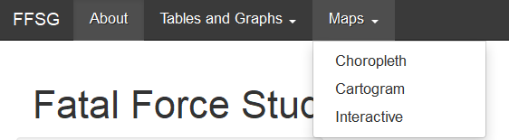
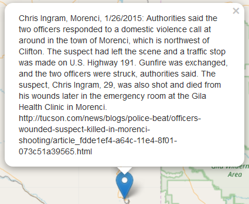

```{r include = FALSE}
knitr::opts_chunk$set(
  collapse = TRUE,
  comment = "#>"
)
```

The goal of this package is to create an easy way for users to be able to directly interact with and explore data on fatal encounters with police. The package consists of several functions which can be used to explore the data. The functions are then used to construct a shiny app which allows the user to investigate the data through an easy to use interface.

#<strong>About Page</strong>

This is the page that the Shiny App opens up to. The page has it's own tab "About Page" on the navigation bar. It provides information on the project and our group. Included is information on Washington state's recent Initiative I-940.
Along The left is a panel that includes links to the databases we used along with additional resources.
The about page appears as below:


#<strong>General Use</strong>

##<u>Navigating the App</u>

###Navigation Bar



The navbar is made up of tabs on the top of the App as shown above. The About page and the categories "Tables & Graphs"" and "Maps"" have tabs. If you click on a tab with a data category it pulls down a selection of pages for the given category. The Tables & Graphs tab pulls down to Counts and Descriptive Statistics. The Maps tab pulls down to Cartogram, Choropleth, and Interactive Map, the maps tab is shown pulled down in the above image. You can then click on a page title to open the page.
  
###Navigation Arrows


Located in the top right of the app are arrows pointing left and/or right. If you click on these buttons it navigates you to the previous or proceeding page accordingly.
  
##<u>Help Buttons</u>

###Page Help Buttons


These buttons provide help for the purpose of the page. They also explain what the output of the page is. These buttons are located on every page in the top right next to the left and right navigation arrows.
  
###Small Help Buttons
These buttons provide help for more specific incidences such as explaining what a check box does. These appear on the right side of what they provide help for.
  
#<strong>Tables & Graphs</strong>

##<u>Counts Page</u>

The Counts page is located under the Graphs & Tables tab. The count page displays total fatal encounters or encounters per capita as a trend over time for each state. The page has two tabs within it to change the output. The first tab is Graph, the output for this tab is a line plot of the data. The second tab is Table, the output of this tab is a table of the data.

###Inputs

On the left side is a control panel that allows the data to be interactable. With three options

  1. The first option is a pull tab labeled State which allows you to select which state you would like to have displayed or highlighted. 
  
  2. The second option is a check box labeled Display with Other States, the default for this box is not-selected this means the state is displayed in the graph or table by itself. If selected the state is graphed in red over the other states' data in grey and the US' data in red or the state is highlighted in yellow listed with all the other states in a table.

  3. The third option is a check box labeled Calculate per Capita (in millions). This box is defaulted to selected meaning the numbers used in the output are the total fatal encounters for the state over the state's population in millions. This allows for more propotional comparisons between states. If not selected the numbers in the output are the total fatal encounters without any modification.
  
Warning: United States' total fatal encounters data cannot be viewed if Display with other states is selected.

###Outputs
These are the two outputs for the Counts page. They are connected to the above inputs so you can test how they change.


<br />
<br />
<br />
<br />
<br />
<br />
<br />
<br />
<br />
<br />
<br />
<br />
<br />
<br />
<br />
<br />
<br />
<br />
<br />
<br />
<br />
<br />


##<u>Descriptive Statistics</u>

The Descriptive Statistics page is located under the Graphs & Tables tab. The Descriptive Statistics page is for viewing the data by a selected demographic. The page displays both a table with counts and a bar graph. 

###Inputs

On the left there is a pull tab that allows you to choose which demographic you want to observe from age, gender, and race.

###Outputs

<strong>Warning:</strong> race includes a lot of missing data so it might not be an accurate description of the true values.

1. The first output given is a table with the counts diplayed for every group within the selected demographic. This allows fofr users to get exact values.

2. Below the first output is a bar graph showing the counts in a more visual way. This allows for a good way to view the distribution.


#<strong>Maps</strong>

##<u>Choropleth Map</u>

The Choropleth Map page is located under the "Maps" tab. This page displays a choropleth map of the fatal encounters per million population averages for each state. The map allows the user to hover over states to get information on state value. The darker the state, the higher per capita value they have. 

###Inputs

1. On the left side panel there is a check box labeled Select Year, if selected then you can view the per capita values for each state by year. 

2. If and only if the Select Year box is selected a slider is given in the left panel. The slider allows the year to be selected. If you hit the play arrow in the bottom right of the slider it plays the map through the years.

###Output

##<u>Cartogram Map</u>

The Cartogram Map page is located under the "Maps" tab. This page displays a cartogram map of the fatal encounters per million population averages for each state.The darker and larger the state, the higher per capita value they have.

###Input

On the left side panel there is a slider to select the year. If you hit the play arrow, in the bottom right of the slider it, plays the map through the years.

###Output


##<u>Interactive Map</u>

The Interactive Map page is located under the Maps tab. This page displays an interactive map of individual cases. The cases are grouped by generated regions and when you zoom in (upper left corner) they spread out and break up. Circles can be clicked on to expand. If you get to a singular point you can click on it to get more information in a pop-up. The pop-up includes the victims name, the city the incident accured in, the date of the incident, a brief description of what happened, and a URL.

###Input

The input for this page is mouse clicks, as you click on bubbles or areas it zooms in. When you click on points it provides a pop up with information on the event.

###Output

The output is a pop up with the information of the event that happened in the location of the pointer. Similar to the one shown below.



###Map

