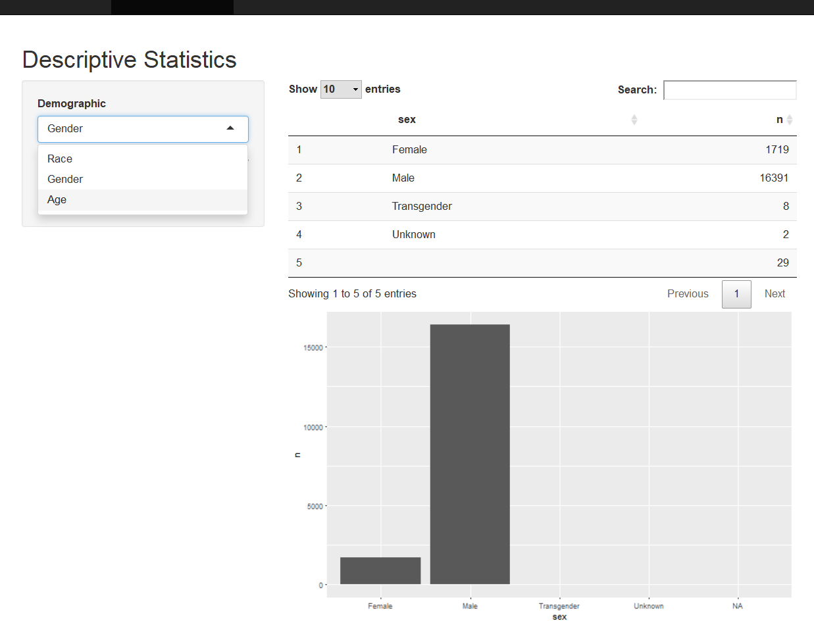

#I am trying to get rid of this slide but am unsure of how to make the black US not render
```{r setup, echo = FALSE,warning=FALSE,message=FALSE}
library(knitr)
library(ggplot2)
library(here)
library(dplyr)
library(DT)
library(shiny)
opts_chunk$set(message = FALSE,
               warning = FALSE)
```


```{r, echo=FALSE}
source(here('Analysis/Tables/permillcalculation.R'))
```

```{r, echo=FALSE, results='hide', message=FALSE}
source(here('Analysis/Graphics/cartogramfunc.R'))
```
---
class: left, top
### Outline
.column[
Goal: To provide open-source, simple tools for exploring the data on fatal 
encounters with police

Simple Exploratory Data Analytics
<ul>
<li>Tables</li>
<li>Static Plots</li>
<li>Interactive Maps</li>
</ul>
Make Data Accessible
<ul>
<li>Shiny</li>
<li>GitHub</li>
</ul>
]

---
class: left, top
### Shiny App
.column[
UI (user interface) - makes what the client sees
```{r, echo=TRUE, eval=FALSE}
tabPanel("Descriptive Statistics",
        fluidPage(titlePanel("Descriptive Statistics"),
          sidebarLayout(
            sidebarPanel(
              selectInput("dem", "Demographic", c("Race", "Gender", "Age")),
              h6("Please take note that the data we have right now is still a work in progress so some of the data is missing. This means that there is a possibility that the trends displayed aren't the true trends for the data.")
            ),
            mainPanel(dataTableOutput("dstbl"), plotOutput("dsplt")))))
```
Server - interacts with r codes and functions
```{r, echo=TRUE, eval=FALSE}
output$dstbl <- renderDataTable({
    dstable(input$dem)
  }) 
  
output$dsplt <- renderPlot({
    dsplot(input$dem)
  })
```
]
---

class: left, top


---

class: left, top
### Tabular Representation
.pull-left[
```{r, echo=FALSE}
df <- permillcalc()
df <- df%>%
  select("state_name", "p2017", "mean")
df[,2:3] <- round(df[,2:3],2)
datatable(df)
```
]

.pull-right[
```{r, echo=FALSE}
source(here('Analysis/Graphics/descstatfuncs.R'))
dstable("Race")
```
]

---

class:left, top
### Static Plots
.pull-left[
```{r, echo=FALSE}
source(here('Analysis/Graphics/permillgraphfunc.R'))
permillgraph("United States", FALSE, TRUE)
```
]

.pull-right[
```{r, echo=FALSE}
source(here('Analysis/Graphics/permillgraphfunc.R'))
permillgraph("Washington", TRUE, TRUE)
```
]

---

class: left, top
### Choropleth
.column[
```{r, echo=FALSE}
source(here('Analysis/Graphics/choroplethmapfunc.R'))
choroplethmap()
```
]
---

class: left, top
### Cartogram
.column[
```{r, echo=FALSE}
ffcartogram(2017)
```
]
---
class:left, top
### Future Work
.column[
Make work publicaly available

Compile into a package with guide

Facebook page

Linked with fatal encounters, killed by police, and campaign 0

Add pics to interactive map
]