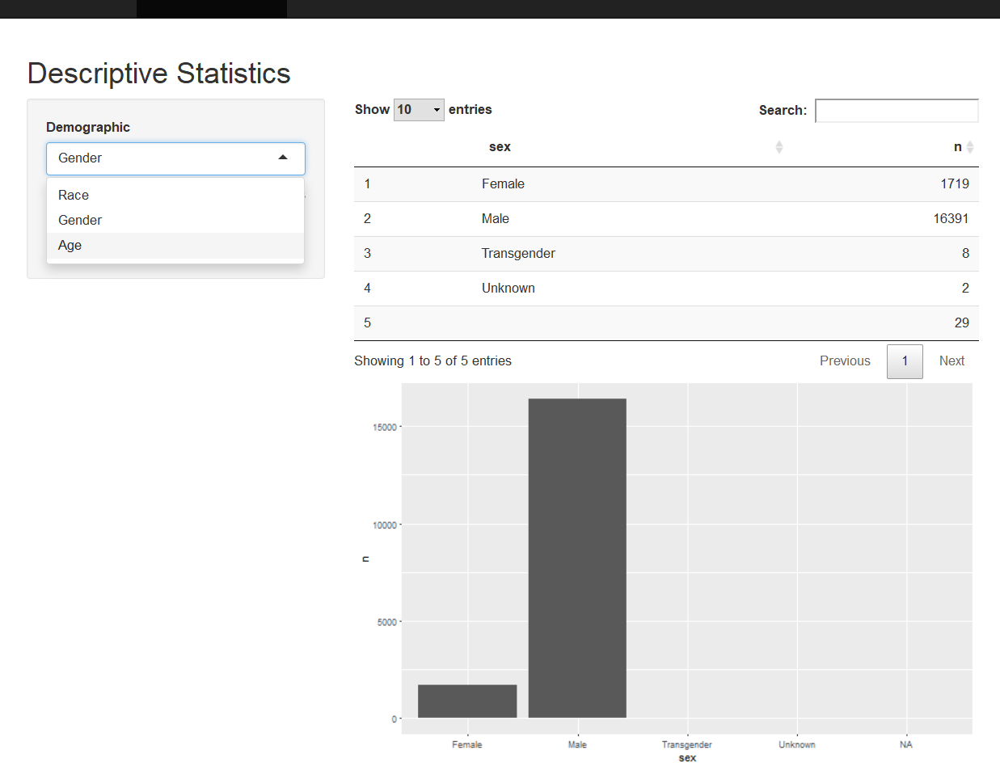

class: top

```{r setup, echo = FALSE,warning=FALSE,message=FALSE}
library(knitr)
opts_chunk$set(message = FALSE,
               warning = FALSE)
```


### Outline

.large[

Goal: To provide open-source, simple tools for exploring the data on fatal 
encounters with police


.pull-left[
**Simple Exploratory Data Analytics Tools**
<ul>
<li>Tables</li>
<li>Static Plots</li>
<li>Interactive Maps</li>
</ul>
]

.pull-right[
**Tools for Public Access**
<ul>
<li><a href="https://ben-marwick.shinyapps.io/FFSG-ShinyApp/">Shiny</a></li>
<li>GitHub</li>
</ul>
]
]

---
### Data sources

.large[
Here we are using the [Fatal Encounters](http://www.fatalencounters.org/) dataset, which is a crowd-sourced, unofficial dataset of people killed by Police in the US.  

The data spans 2000-2018, about 21,000 records.

Jainul Vaghasia's research has partially cleaned these data. 
]

---
class: left, top
### Shiny App
.column[
UI (user interface) - makes what the client sees
```{r, echo=TRUE, eval=FALSE}
fluidPage(titlePanel("Descriptive Statistics"),
          sidebarLayout(
            sidebarPanel(
              selectInput("dem", "Demographic", c("Race", "Gender", "Age")),
              h6("Please take note that the data we have right now is still a work in progress so some of the data is missing. This means that there is a possibility that the trends displayed aren't the true trends for the data.")
            ),
            mainPanel(dataTableOutput("dstbl"), plotOutput("dsplt"))))
```
Server - interacts with r codes and functions
```{r, echo=TRUE, eval=FALSE}
output$dstbl <- renderDataTable({
    dstable(input$dem)
  }) 
  
output$dsplt <- renderPlot({
    dsplot(input$dem)
  })
```
]
---
class: left, top

Screenshot from our app: <https://ben-marwick.shinyapps.io/FFSG-ShinyApp/>



---
class:left, top
### Future Work

.large[
- Add pictures to cases in interactive map    

- Finalize app and make publicly available: <https://ben-marwick.shinyapps.io/FFSG-ShinyApp>     

- Compile into a package with guide    

- Facebook Page     

- Linked with Fatal Encounters, Killed by Police, and Campaign Zero    
]